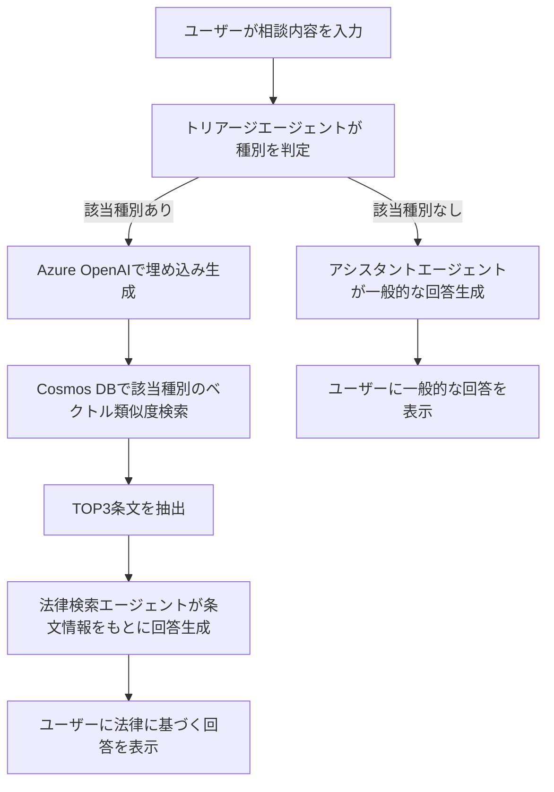
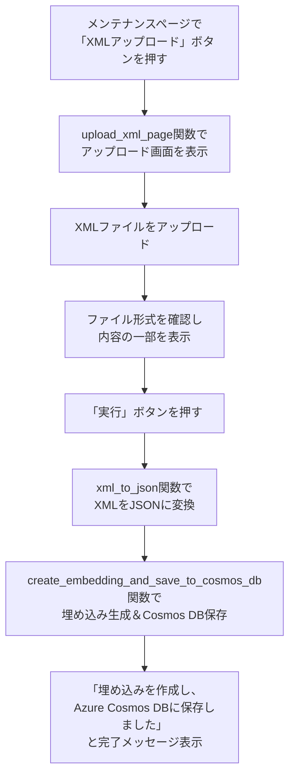
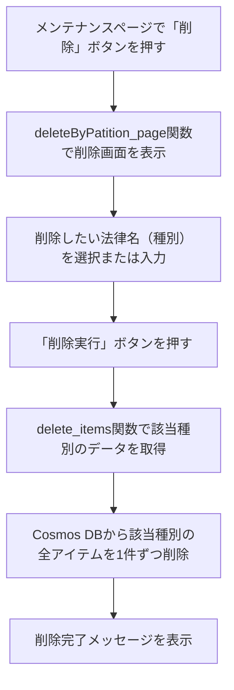
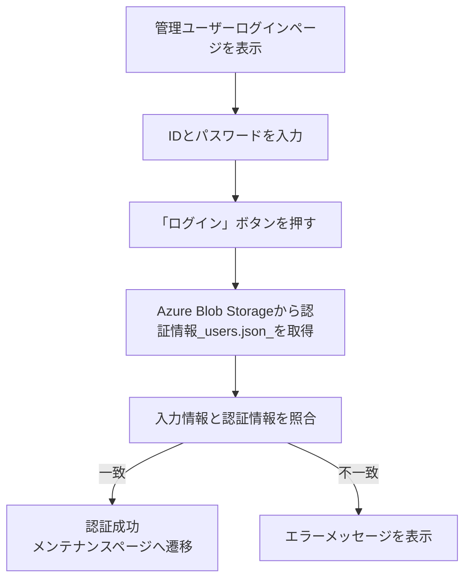
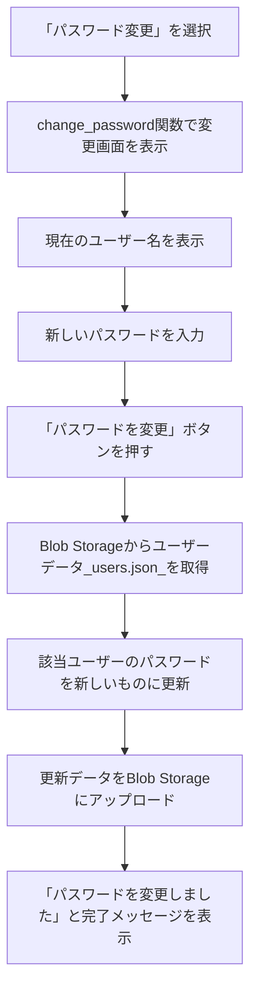

# 困りごと相談アプリ
このアプリは、法律相談を支援するAIチャットアプリです。主な特徴は以下の通りです。

StreamlitベースのWebアプリで、ユーザーが困りごとや相談内容を入力できます。  
Azure Cosmos DBに保存された法律データ（種別・条文名・内容）を参照し、ユーザーの相談に関連する法律情報を検索・提示します。  
Azure OpenAIの埋め込みモデルを使い、ユーザーの入力内容と法律データのベクトル類似度検索を行います。  
Azure AI Foundryのエージェント（トリアージ・法律検索・アシスタント）を活用し、相談内容の分類や回答生成を自動化しています。  
管理者はXMLファイルによる法律データのアップロードやユーザー管理が可能です。  
主な利用シーンは、ユーザーが法律に関する困りごとを入力すると、AIが関連する法律条文を自動で検索し、分かりやすく提示することです。  

### 概要図


## 相談内容の処理
相談時のテキスト入力値は、以下の流れで処理されます。
・トリアージエージェントの役割  
　ユーザーが入力した相談内容を、AI Foundryの「トリアージエージェント」が受け取り、Cosmos DBに登録されている「種別」リストの中から該当する種別を判定します。該当がなければ「なし」と返します。

・埋め込み作成とCosmos DB検索  
　トリアージで該当種別が判定された場合、Azure OpenAIの埋め込みモデルで相談内容のベクトル（埋め込み）を生成します。そのベクトルを使い、Cosmos DB内の該当種別データからベクトル類似度検索（VectorDistance）を行い、最も近い条文（TOP3）を抽出します。

・法律検索エージェントの役割  
　抽出した条文情報をプロンプトに含めて、AI Foundryの「法律検索エージェント」がユーザーの相談内容に関連する法律情報を詳しく調べて回答します。

・アシスタントエージェントの役割  
　トリアージで該当種別が「なし」と判定された場合は、「アシスタントエージェント」が一般的な法律相談として親切に回答します。

このように、相談内容はまずAIで分類（トリアージ）され、該当があれば埋め込みを使ってCosmos DBから関連法令を検索し、さらにAIがその内容をもとに最適な回答を生成します。

## 法律検索サイトからダウンロードしたXMLファイルをCosmosDBに保存
[e-Gov法令検索サイト](https://laws.e-gov.go.jp/)'からダウンロードしたXMLファイルをデータベースに追加できます。  
XMLファイル追加時の流れは以下の通りです。

1.メンテナンスページで「XMLアップロード」ボタンを押す  
　→ upload_xml_page 関数が呼ばれ、アップロード画面が表示されます。

2.e-Gov法令検索サイト等から取得したXMLファイルをアップロード  
　→ ファイル形式がXMLか確認され、内容の一部が画面に表示されます。

3.「実行」ボタンを押すと、XMLの内容がパースされJSON化  
　→ xml_to_json 関数で法律名・条文ごとにデータを抽出し、JSON形式に変換します。

4.埋め込み生成とCosmos DB保存  
　→ create_embedding_and_save_to_cosmos_db 関数で、各条文ごとにAzure OpenAIで埋め込みベクトルを生成し、Cosmos DBに法律名（種別）ごとに保存します。

5.完了メッセージ表示  
　→ 「埋め込みを作成し、Azure Cosmos DBに保存しました」と表示され、法律データが検索対象として利用可能になります。

## データ削除
Cosmos DBからデータを削除する流れは以下の通りです。

1.メンテナンスページで「削除」ボタンを押す  
　→ deleteByPatition_page 関数が呼ばれ、削除画面が表示されます。

2.削除したい法律名（種別）を選択または入力  
　→ 画面上で対象の種別（パーティションキー）を指定します。

3.「削除実行」ボタンを押す  
　→ delete_items 関数が呼ばれ、指定した種別のデータをCosmos DBから一括取得します。

4.該当データを1件ずつ削除  
　→ Cosmos DBの該当コンテナから、指定種別の全アイテムをループで削除します。

5.削除完了メッセージを表示  
　→ 「削除が完了しました」などのメッセージが画面に表示されます。

この流れにより、法律名（種別）単位でCosmos DB内のデータを安全に削除できます。


## 管理ユーザーログイン
管理ユーザーログインの流れは以下の通りです。

1.ログイン画面表示  
　authenticate関数で管理ユーザーログインページが表示されます。

2.IDとパスワードの入力  
　ユーザーがIDとパスワードを入力します。

3.認証情報の取得  
　get_credentials_from_blob関数でAzure Blob Storageからユーザー情報（users.json）を取得します。

4.認証チェック  
　入力されたIDとパスワードが取得したユーザー情報と一致するか確認します。

5.認証結果による遷移  
　一致すればst.session_state.authenticatedをTrueにし、メンテナンスページへ遷移します。不一致ならエラーメッセージを表示します。
 

## ユーザーパスワード変更
ユーザーパスワード変更の流れは以下の通りです。

1.メンテナンスページやサイドバーから「パスワード変更」を選択  
　→ change_password関数が呼ばれ、パスワード変更画面が表示されます。

2.現在ログイン中のユーザー名が画面に表示される  
　→ セッションからユーザー名を取得し、どのユーザーのパスワードを変更するか明示します。

3.新しいパスワードを入力  
　→ 入力欄に新しいパスワードを入力します。

4.「パスワードを変更」ボタンを押す  
　→ 入力内容をチェックし、Blob Storageからユーザーデータ（users.json）を取得します。

5.該当ユーザーのパスワードを更新  
　→ 入力されたユーザー名と一致するデータのパスワードを新しいものに書き換えます。

6.Blob Storageへ更新データをアップロード  
　→ 変更後のデータをupload_blob_dataで保存します。

7.完了メッセージを表示  
　→ 「パスワードを変更しました」と画面に表示されます。

## ユーザー追加
ユーザー追加の流れは以下の通りです。

1.管理者ページで「ユーザー追加」を選択  
　→ add_user関数が呼ばれ、ユーザー追加画面が表示されます。

2.現在のユーザー一覧を表示  
　→ Azure Blob Storageからusers.jsonを取得し、テーブルで表示します。

3.新しいユーザー名とパスワードを入力  
　→ 入力欄に追加したいユーザー名とパスワードを入力します。

4.「ユーザーを追加」ボタンを押す  
　→ 入力内容をチェックし、ユーザー名の重複がないか確認します。

5.新規ユーザーをリストに追加  
　→ 重複がなければ新しいユーザー情報をリストに追加します。

6.更新後のリストをBlob Storageにアップロード  
　→ upload_blob_data関数で新しいユーザーリストを保存します。

7.追加完了メッセージと更新後のユーザー一覧を表示  
　→ 成功メッセージとともに、最新のユーザー一覧を画面に表示します。
 ```mermaid
flowchart TD
    A[管理者ページで「ユーザー追加」を選択] --> B[add_user関数で追加画面を表示]
    B --> C[現在のユーザー一覧を表示]
    C --> D[新しいユーザー名とパスワードを入力]
    D --> E[「ユーザーを追加」ボタンを押す]
    E --> F[ユーザー名の重複をチェック]
    F -- 重複なし --> G[新規ユーザーをリストに追加]
    G --> H[更新後のリストをBlob Storageにアップロード]
    H --> I[追加完了メッセージと更新後のユーザー一覧を表示]
    F -- 重複あり --> J[「ユーザー名は既に存在します」とエラー表示]
```
 
## ユーザー削除
ユーザー削除の流れは以下の通りです。

1.管理者ページで「ユーザー削除」を選択  
　→ del_user関数が呼ばれ、ユーザー削除画面が表示されます。

2.現在のユーザー一覧を表示  
　→ Azure Blob Storageからusers.jsonを取得し、テーブルで表示します。

3.削除したいユーザー名を入力  
　→ 入力欄に削除対象のユーザー名を入力します。

4.「削除」ボタンを押す  
　→ 入力されたユーザー名がリストに存在するか確認します。

5.該当ユーザーをリストから削除  
　→ delete_user関数で該当ユーザーを除外したリストを作成します。

6.更新後のリストをBlob Storageにアップロード  
　→ upload_blob_data関数で新しいユーザーリストを保存します。

7.削除完了メッセージと更新後のユーザー一覧を表示  
　→ 成功メッセージとともに、最新のユーザー一覧を画面に表示します。

 ```mermaid
flowchart TD
    A[管理者ページで「ユーザー削除」を選択] --> B[del_user関数で削除画面を表示]
    B --> C[現在のユーザー一覧を表示]
    C --> D[削除したいユーザー名を入力]
    D --> E[「削除」ボタンを押す]
    E --> F[入力ユーザー名が存在するか確認]
    F -- 存在する --> G[delete_user関数で該当ユーザーをリストから削除]
    G --> H[upload_blob_dataで更新データをBlob Storageに保存]
    H --> I[削除完了メッセージと更新後のユーザー一覧を表示]
    F -- 存在しない --> J[「ユーザーは見つかりませんでした」と警告表示]
```

## 各モジュールと関数
### main.py
・delete_all_threads  
　Azure AI Foundryの全スレッド（会話履歴）を非同期で削除する関数。リセット時に使用。

・main_page  
　Streamlitでメイン画面を表示し、Cosmos DBから法律データを取得・表示。ユーザーの相談入力を受け、AIエージェントによるトリアージ・法律検索・回答を実行し、会話履歴を管理・表示する。

・score_to_percent（main_page内のローカル関数）  
　ベクトル距離（類似度スコア）を0～100%のパーセント値に変換する補助関数。検索結果の見やすさ向上に利用。

ページ遷移用のif文  
　セッション状態に応じて、main_pageや管理者認証、メンテナンス、ユーザー管理など各ページの表示・処理を切り替える。

### maintenance.py
・get_credentials_from_blob  
　Azure Blob Storageからユーザー認証情報（users.json）を取得し、JSON形式で返す。

・authenticate  
　管理ユーザーのログイン画面を表示し、入力情報とBlob上の認証情報を照合して認証・ページ遷移を行う。

・maintenance_page  
　メンテナンス画面を表示し、法律データの一覧表示やXMLアップロード・削除ページへの遷移を提供する。

・change_password  
　現在ログイン中のユーザーのパスワードを変更し、Blob Storageへ反映する。

・upload_xml_page  
　法律XMLファイルのアップロード・内容確認・Cosmos DBへの保存処理を行う。

・create_embedding_and_save_to_cosmos_db  
　アップロードされた法律データから埋め込みを生成し、Cosmos DBに保存する。

・deleteByPatition_page  
　指定した法律名（種別）単位でCosmos DBからデータを削除する画面を提供する。

・delete_items  
　Cosmos DBから指定パーティションキー（種別）の全アイテムを削除する。

・extract_text_from_pdf  
　アップロードされたPDFファイルから全ページのテキストを抽出する。

・extract_text_from_xml  
　XML要素から再帰的にテキストを抽出しリスト化する。

・xml_to_json  
　XML形式の法律データをJSON形式に変換する。

・get_admin_credentials_from_blob  
　Azure Blob Storageから管理者認証情報（admi.json）を取得し、JSON形式で返す。

・authenticate_admin  
　管理者ログイン画面を表示し、認証情報を照合して認証・ページ遷移を行う。

・admin  
　管理者ページを表示し、ユーザーの追加・削除画面への遷移を提供する。

・download_blob_data  
　Azure Blob Storageからユーザーデータ（users.json）をダウンロードし、JSON形式で返す。

・upload_blob_data  
　ユーザーデータをJSON形式でBlob Storageにアップロードする。

・add_user  
　新規ユーザーを追加し、Blob Storageへ保存する。

・delete_user  
　指定したユーザー名のデータをリストから削除し、更新後のリストを返す。

・del_user  
　ユーザー削除画面を表示し、指定ユーザーの削除とBlob Storageへの反映を行う。

### keys.py
Azure Key Vaultから各種サービス（AI Foundry、Azure OpenAI、Cosmos DB、Blob Storage）のシークレット値（エンドポイントやAPIキー、接続文字列など）を安全に取得し、グローバル変数として他モジュールで利用できるようにする。
