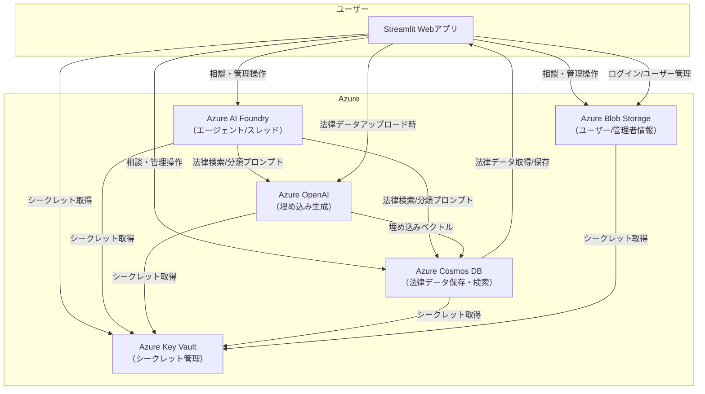
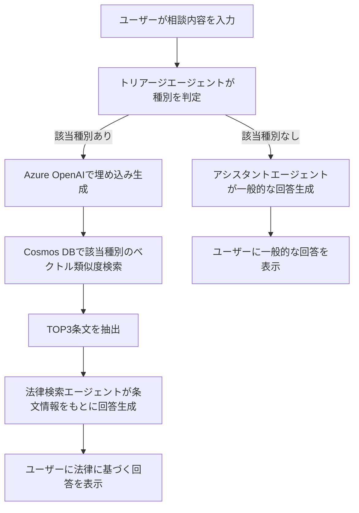
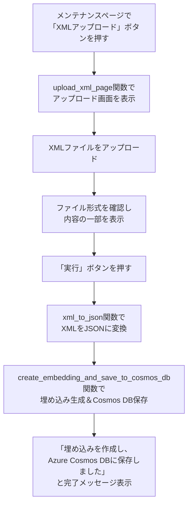

このアプリは、法律相談を支援するAIチャットアプリです。主な特徴は以下の通りです。

StreamlitベースのWebアプリで、ユーザーが困りごとや相談内容を入力できます。
Azure Cosmos DBに保存された法律データ（種別・条文名・内容）を参照し、ユーザーの相談に関連する法律情報を検索・提示します。
Azure OpenAIの埋め込みモデルを使い、ユーザーの入力内容と法律データのベクトル類似度検索を行います。
Azure AI Foundryのエージェント（トリアージ・法律検索・アシスタント）を活用し、相談内容の分類や回答生成を自動化しています。
管理者はXMLファイルによる法律データのアップロードやユーザー管理が可能です。
主な利用シーンは、ユーザーが法律に関する困りごとを入力すると、AIが関連する法律条文を自動で検索し、分かりやすく提示することです。

相談時のテキスト入力値は、以下の流れで処理されます。

トリアージエージェントの役割
　ユーザーが入力した相談内容を、AI Foundryの「トリアージエージェント」が受け取り、Cosmos DBに登録されている「種別」リストの中から該当する種別を判定します。該当がなければ「なし」と返します。

埋め込み作成とCosmos DB検索
　トリアージで該当種別が判定された場合、Azure OpenAIの埋め込みモデルで相談内容のベクトル（埋め込み）を生成します。そのベクトルを使い、Cosmos DB内の該当種別データからベクトル類似度検索（VectorDistance）を行い、最も近い条文（TOP3）を抽出します。

法律検索エージェントの役割
　抽出した条文情報をプロンプトに含めて、AI Foundryの「法律検索エージェント」がユーザーの相談内容に関連する法律情報を詳しく調べて回答します。

アシスタントエージェントの役割
　トリアージで該当種別が「なし」と判定された場合は、「アシスタントエージェント」が一般的な法律相談として親切に回答します。

このように、相談内容はまずAIで分類（トリアージ）され、該当があれば埋め込みを使ってCosmos DBから関連法令を検索し、さらにAIがその内容をもとに最適な回答を生成します。

XMLファイル追加時の流れは以下の通りです。

メンテナンスページで「XMLアップロード」ボタンを押す
　→ upload_xml_page 関数が呼ばれ、アップロード画面が表示されます。

e-Gov法令検索サイト等から取得したXMLファイルをアップロード
　→ ファイル形式がXMLか確認され、内容の一部が画面に表示されます。

「実行」ボタンを押すと、XMLの内容がパースされJSON化
　→ xml_to_json 関数で法律名・条文ごとにデータを抽出し、JSON形式に変換します。

埋め込み生成とCosmos DB保存
　→ create_embedding_and_save_to_cosmos_db 関数で、各条文ごとにAzure OpenAIで埋め込みベクトルを生成し、Cosmos DBに法律名（種別）ごとに保存します。

完了メッセージ表示
　→ 「埋め込みを作成し、Azure Cosmos DBに保存しました」と表示され、法律データが検索対象として利用可能になります。

 
#main.py
delete_all_threads
Azure AI Foundryの全スレッド（会話履歴）を非同期で削除する関数。メンテナンスやリセット時に使用。

main_page
Streamlitでメイン画面を表示し、Cosmos DBから法律データを取得・表示。ユーザーの相談入力を受け、AIエージェントによるトリアージ・法律検索・回答を実行し、会話履歴を管理・表示する。

score_to_percent（main_page内のローカル関数）
ベクトル距離（類似度スコア）を0～100%のパーセント値に変換する補助関数。検索結果の見やすさ向上に利用。

ページ遷移用のif文
セッション状態に応じて、main_pageや管理者認証、メンテナンス、ユーザー管理など各ページの表示・処理を切り替える。

#maintenance.py
get_credentials_from_blob
Azure Blob Storageからユーザー認証情報（users.json）を取得し、JSON形式で返す。

authenticate
管理ユーザーのログイン画面を表示し、入力情報とBlob上の認証情報を照合して認証・ページ遷移を行う。

maintenance_page
メンテナンス画面を表示し、法律データの一覧表示やXMLアップロード・削除ページへの遷移を提供する。

change_password
現在ログイン中のユーザーのパスワードを変更し、Blob Storageへ反映する。

upload_xml_page
法律XMLファイルのアップロード・内容確認・Cosmos DBへの保存処理を行う。

create_embedding_and_save_to_cosmos_db
アップロードされた法律データから埋め込みを生成し、Cosmos DBに保存する。

deleteByPatition_page
指定した法律名（種別）単位でCosmos DBからデータを削除する画面を提供する。

delete_items
Cosmos DBから指定パーティションキー（種別）の全アイテムを削除する。

extract_text_from_pdf
アップロードされたPDFファイルから全ページのテキストを抽出する。

extract_text_from_xml
XML要素から再帰的にテキストを抽出しリスト化する。

xml_to_json
XML形式の法律データをJSON形式に変換する。

get_admin_credentials_from_blob
Azure Blob Storageから管理者認証情報（admi.json）を取得し、JSON形式で返す。

authenticate_admin
管理者ログイン画面を表示し、認証情報を照合して認証・ページ遷移を行う。

admin
管理者ページを表示し、ユーザーの追加・削除画面への遷移を提供する。

download_blob_data
Azure Blob Storageからユーザーデータ（users.json）をダウンロードし、JSON形式で返す。

upload_blob_data
ユーザーデータをJSON形式でBlob Storageにアップロードする。

add_user
新規ユーザーを追加し、Blob Storageへ保存する。

delete_user
指定したユーザー名のデータをリストから削除し、更新後のリストを返す。

del_user
ユーザー削除画面を表示し、指定ユーザーの削除とBlob Storageへの反映を行う。

#keys.py
主な役割は、Azure Key Vaultから各種サービス（AI Foundry、Azure OpenAI、Cosmos DB、Blob Storage）のシークレット値（エンドポイントやAPIキー、接続文字列など）を安全に取得し、グローバル変数として他モジュールで利用できるようにすることです。
